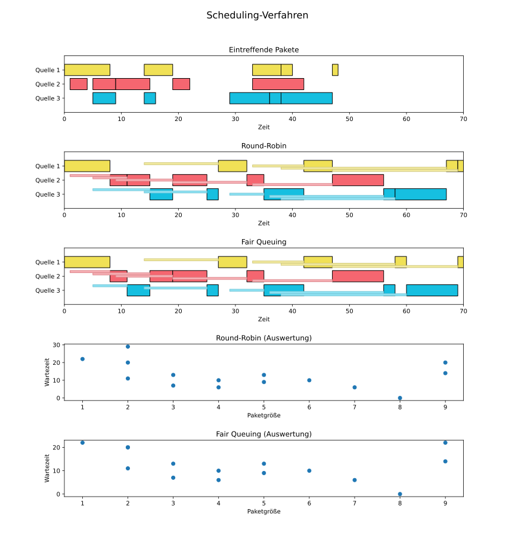

# network-scheduling
A comparison of **Round-Robin** and **Fair Queuing**. Programmed as a small project at the DHBW Karlsruhe.

*© Dominic Plein, 11/2020*

## Package Simulation
The sources that send out packages are randomized, so you get new graphs each time you run the code. Try to change the simulation by altering the parameters of `simulate_packages(...)` (called in `ìndex.py`):

- `number_of_total_processes`
- `max_arrival_time`
- `max_package_size`

## How to read the graphs
The first bar chart represents the incoming packages as the three sources send them.

The second bar chart indicates how the incoming packages get processed over time sequentially using **Round-Robin** scheduling (every source gets one turn, i.e.: process one package from source1, then process one package from source2, then from source3 and start again with source1).

The third bar chart is used for the same purpose, but now we use **Fair-Queuing** to process the packages sequentially. This means that if two packages arrive at the same time, we pick the one that would have been finished first if we had started to process it immediately after its arrival.

The bright bars indicate the `waiting_time`, which is defined as the time span between when the package actually arrived and when we started to really process it. The two scatter plots at the end show the waiting time for different packages sizes.

## How to install
- Clone this Git repository: 
`git clone https://github.com/Ordinateur-Hack/network-scheduling.git`
- Entry point is `index.py`. Execute it using Python 3.7 (since Matplotlib is not compatible with the latest Python versions yet at the time of writing).
- A Matplotlib-window should pop up and a .svg file
(`Scheduling.svg`) is saved to your desktop.

## Tools used
- Python 3.7
- [Matplotlib](https://matplotlib.org/): an awesome Python library for visualizations (and all that goes with it); check out the [examples](https://matplotlib.org/gallery/index.html), I bet there's a graph type for every use case 🙃
- [Numpy](https://numpy.org/): "The fundamental package for scientific computing with Python"
